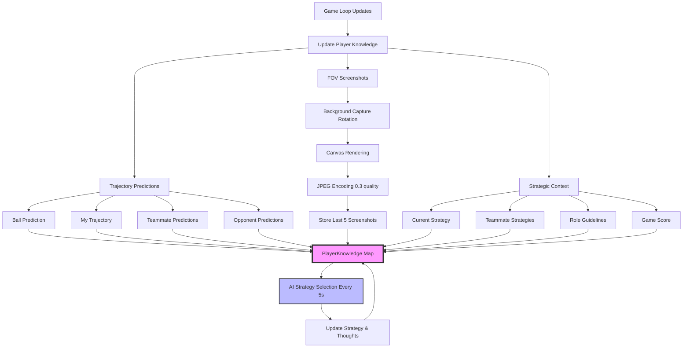
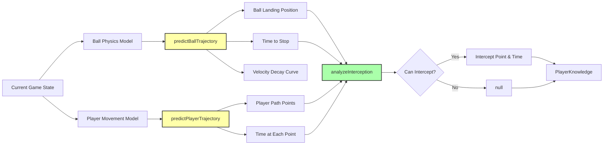
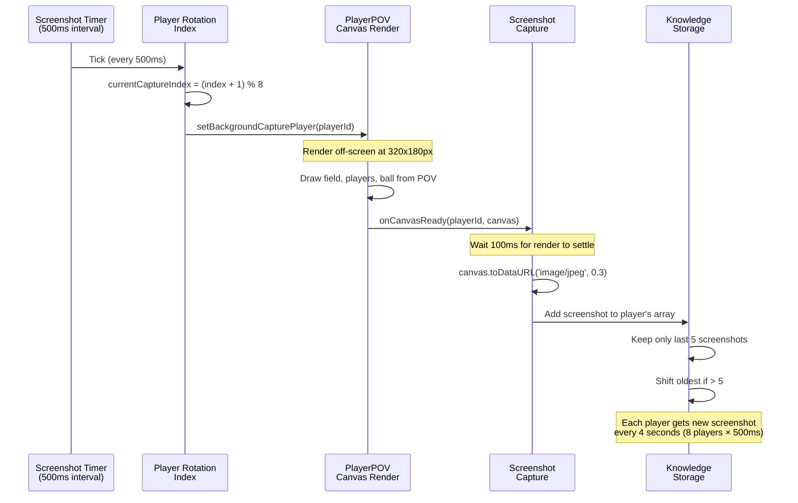
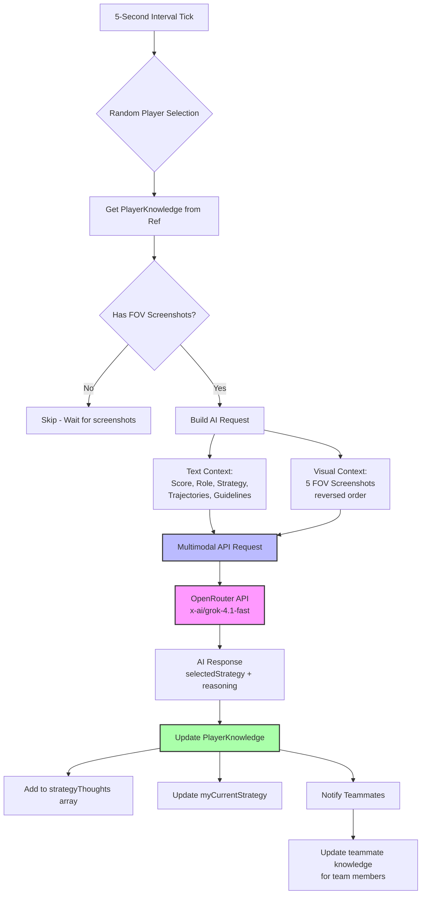
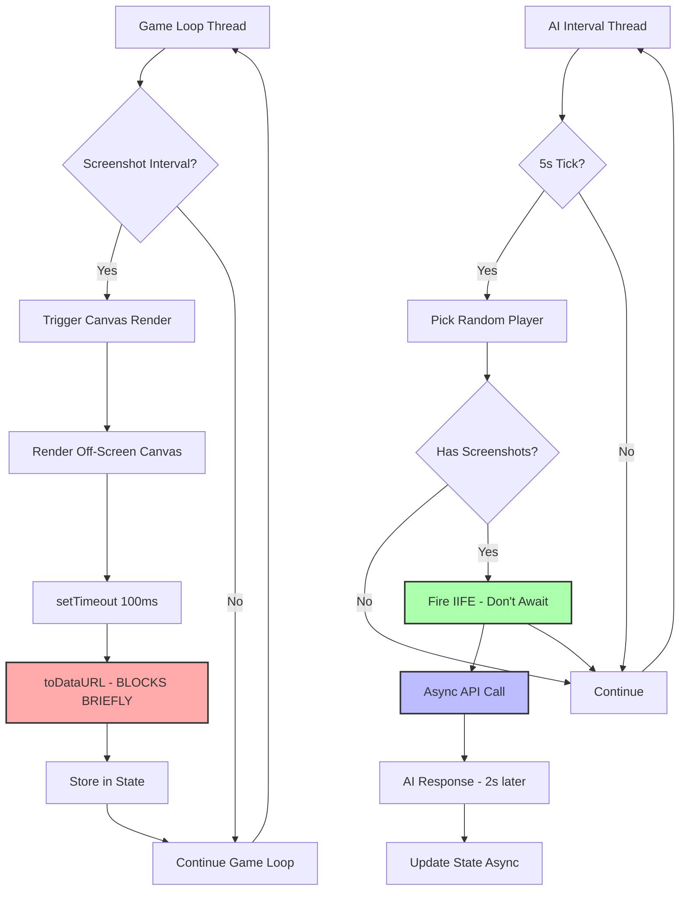
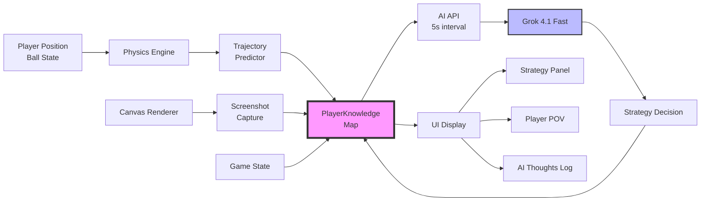

# Player Knowledge Base Architecture

This document explains how each AI player builds and maintains their knowledge base in the tactical football game.

## Overview

Each player maintains a comprehensive `PlayerKnowledge` object that combines:
- **Visual perception** (FOV screenshots)
- **Trajectory predictions** (physics-based forecasting)
- **Strategic context** (team strategies, role descriptions)
- **AI decision history** (past strategy thoughts)

---

## 1. Knowledge Base Population Flow



**Why this architecture?**
- **Separation of concerns**: Visual, physics, and strategic data are computed independently
- **Efficient updates**: Only changed data triggers updates
- **Non-blocking**: FOV capture and AI calls don't freeze the game loop

---

## 2. Trajectory Prediction System



**Trajectory Prediction Details:**

### Ball Trajectory
- **Physics-based**: Uses actual ball velocity + friction coefficient
- **Lookahead**: Simulates ~200 frames into the future
- **Outputs**: Landing position, time to stop, trajectory points

### Player Trajectory
- **Movement model**: Considers current velocity and target direction
- **Friction applied**: Same physics as actual game loop
- **Outputs**: Array of {x, y, time} points showing predicted path

### Interception Analysis
- **For each trajectory point**: Check if player can reach that position in time
- **Distance vs. Time**: Compares ball arrival time vs. player travel time
- **Earliest intercept**: Finds the soonest possible interception point

**Why this matters:**
- AI can see "into the future" and make proactive decisions
- Players know if they should chase the ball or defend position
- Enables tactical coordination (e.g., "teammate is closer, I'll cover space")

---

## 3. FOV Screenshot Capture System



**Capture Optimization:**

| Parameter | Value | Reasoning |
|-----------|-------|-----------|
| **Interval** | 500ms | Balance between data freshness and CPU load |
| **Quality** | 0.3 | AI doesn't need high-res, saves encoding time |
| **Resolution** | 320×180 | Small enough for performance, big enough for AI |
| **Buffer Size** | 5 images | 20 seconds of visual history at 4s/frame |
| **Format** | JPEG | Better compression than PNG for photos |

**Why rotating capture?**
- Only 1 canvas rendered at a time → minimal GPU/CPU usage
- All 8 players get fresh screenshots regularly
- No simultaneous renders that could cause lag

---

## 4. AI Decision Making Flow



**AI Request Structure:**

```typescript
{
  model: "x-ai/grok-4.1-fast",
  messages: [
    {
      role: "user",
      content: [
        {
          type: "text",
          text: "Game State + Trajectories + Guidelines..."
        },
        { type: "image_url", url: "data:image/jpeg;base64,..." }, // Screenshot 5
        { type: "image_url", url: "data:image/jpeg;base64,..." }, // Screenshot 4
        { type: "image_url", url: "data:image/jpeg;base64,..." }, // Screenshot 3
        { type: "image_url", url: "data:image/jpeg;base64,..." }, // Screenshot 2
        { type: "image_url", url: "data:image/jpeg;base64,..." }  // Screenshot 1 (most recent)
      ]
    }
  ],
  response_format: { type: "json_object" }
}
```

**Why this approach?**
- **Fire-and-forget**: IIFE pattern ensures game never blocks
- **Multimodal**: AI sees what the player sees + knows physics
- **Contextual**: Full game state gives AI complete tactical picture
- **Historical**: 5 screenshots show movement trends over 20 seconds

---

## 5. PlayerKnowledge Data Structure

```mermaid
classDiagram
    class PlayerKnowledge {
        +string playerId
        +string team (red|blue)
        +object currentScore
        +string[] fovScreenshots (last 5)

        +string myCurrentStrategy
        +object[] teammateStrategies
        +string myGoalSide
        +string opponentGoalSide
        +string myRole (GK|FIELD)

        +object roleDescriptions
        +object strategyGuidelines
        +object whenToUseStrategies

        +BallPrediction ballPrediction
        +TrajectoryPoint[] myTrajectory
        +PlayerPrediction[] teammatePredictions
        +PlayerPrediction[] opponentPredictions
        +boolean canInterceptBall
        +object myInterceptPoint
        +number timeToInterceptBall

        +StrategyThought[] strategyThoughts
    }

    class BallPrediction {
        +object landingPosition {x, y}
        +number timeToStop
        +TrajectoryPoint[] trajectory
    }

    class PlayerPrediction {
        +string playerId
        +TrajectoryPoint[] trajectory
        +boolean canInterceptBall
        +object interceptPoint
        +number timeToIntercept
    }

    class StrategyThought {
        +number timestamp
        +string previousStrategy
        +string selectedStrategy
        +string reasoning
    }

    PlayerKnowledge --> BallPrediction
    PlayerKnowledge --> PlayerPrediction
    PlayerKnowledge --> StrategyThought
```

**Data Categories:**

1. **Identity & Context** (static during game)
   - Player ID, team color, role
   - Goal positions (left/right)

2. **Visual Perception** (updated every 4s per player)
   - 5 base64-encoded JPEG screenshots
   - 320×180px resolution at 0.3 quality
   - Most recent = index 4, oldest = index 0

3. **Physics Predictions** (updated every frame)
   - Ball trajectory and landing
   - Own predicted movement
   - All teammate trajectories + intercept analysis
   - All opponent trajectories + threat analysis

4. **Strategic State** (updated by AI every 5s avg)
   - Current strategy
   - Teammate strategies (synchronized)
   - Available strategies by category

5. **Game Knowledge** (static reference data)
   - Role descriptions (GK vs FIELD)
   - Strategy guidelines (offensive/defensive/balanced)
   - Situational advice (winning/losing/tied)

6. **Decision History** (append-only log)
   - Array of past AI decisions
   - Timestamp, old strategy, new strategy, reasoning
   - Used for displaying "AI thoughts" in UI

---

## 6. Knowledge Update Timing

```mermaid
gantt
    title Player Knowledge Update Timeline
    dateFormat X
    axisFormat %L ms

    section Game Loop (60 FPS)
    Physics Update          :0, 16
    Trajectory Prediction   :16, 32
    Knowledge Map Update    :32, 34
    Render Frame           :34, 50

    section FOV Capture (500ms intervals)
    Player 0 Screenshot    :0, 50
    Player 1 Screenshot    :500, 550
    Player 2 Screenshot    :1000, 1050
    Player 3 Screenshot    :1500, 1550
    Player 4 Screenshot    :2000, 2050
    Player 5 Screenshot    :2500, 2550
    Player 6 Screenshot    :3000, 3050
    Player 7 Screenshot    :3500, 3550
    Full Cycle Complete    :4000, 4001

    section AI Strategy (5s intervals)
    Random Player Decision :5000, 7000
    Update Knowledge      :7000, 7010
    Next Decision         :10000, 12000
```



**Update Frequencies:**

| Component | Frequency | Why? |
|-----------|-----------|------|
| **Trajectory Predictions** | Every frame (60 FPS) | Physics changes constantly |
| **FOV Screenshots** | Every 4s per player | Balance freshness vs performance |
| **AI Strategy Decisions** | Every 5s (random player) | LLM latency ~2s, avoid overwhelming API |
| **Knowledge Map Sync** | Every frame | React state management |

---

## 7. Non-Blocking Architecture



**Key Non-Blocking Patterns:**

1. **FOV Capture**:
   - Canvas render happens off-screen
   - 100ms setTimeout allows render to complete
   - toDataURL blocks ~10-30ms (acceptable)

2. **AI Calls**:
   - IIFE (Immediately Invoked Function Expression)
   - No `await` in the interval callback
   - Responses update state whenever they arrive

3. **Multiple In-Flight Requests**:
   - AI calls don't wait for previous calls
   - If one takes 10s, next interval still fires
   - State updates are atomic via React's setState

**Why this matters:**
- Game runs at solid 60 FPS
- Screenshots captured smoothly in background
- AI decisions arrive asynchronously without blocking
- User never experiences freezing or lag

---

## 8. Data Flow Summary



---

## Performance Characteristics

### CPU Usage
- **Game Loop**: ~5-10% (physics, rendering)
- **Screenshot Capture**: ~2-5% spike every 500ms (JPEG encoding)
- **AI Calls**: ~0% (network I/O, happens on server)

### Memory Usage
- **5 Screenshots × 8 Players**: ~1-2 MB (base64 strings)
- **Trajectory Data**: ~100 KB (arrays of points)
- **Knowledge Maps**: ~200 KB (strategic data)
- **Total**: ~2-3 MB for entire knowledge system

### Network Usage
- **AI Request Size**: ~500 KB (5 images + text)
- **AI Response Size**: ~1 KB (JSON)
- **Frequency**: ~12 requests/minute (1 every 5s)
- **Total Bandwidth**: ~6 MB/minute

---

## Why This Architecture Works

1. **Separation of Concerns**
   - Visual, physics, and strategic systems are independent
   - Each can be optimized separately
   - Failures in one don't cascade to others

2. **Temporal Decoupling**
   - Fast updates (physics) don't wait for slow updates (AI)
   - Slow updates (screenshots) don't block fast updates
   - Everything happens "eventually" without hard dependencies

3. **Progressive Enhancement**
   - Game works without AI (uses default strategies)
   - AI works with minimal screenshots (needs just 1)
   - Full knowledge base provides best decisions

4. **Scalability**
   - Adding more players just extends rotation time
   - AI latency doesn't affect game performance
   - Knowledge system is O(n) in player count

5. **Debuggability**
   - Every component logs its actions
   - Knowledge state is inspectable via React DevTools
   - AI decisions include reasoning for transparency
